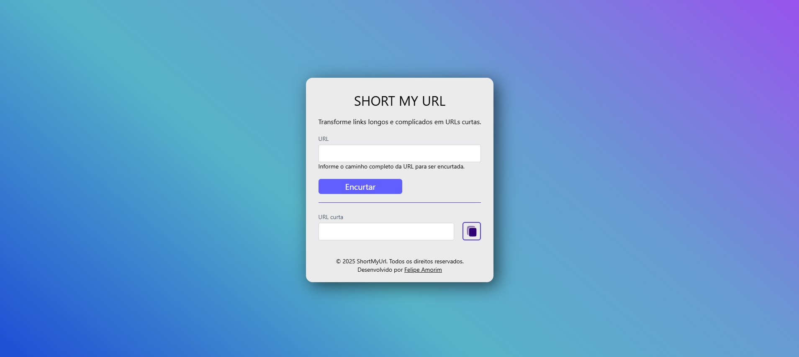

# ShortMyUrl

ShortMyUrl é uma aplicação web desenvolvida com Angular 19 que através do back-end ShortMyUrl permite encurtar URLs longas de forma simples e rápida.

  

## 🚀 Tecnologias

[](https://angular.io/)
[](https://tailwindcss.com/)
[](https://www.typescriptlang.org/)
[](https://rxjs.dev/)
## 📸 Demonstração

https://github.com/user-attachments/assets/8d05159e-b18b-4bc6-88f4-ec6695e0bc6e

## 🛠️ Instalação

1. **Clone o repositório:**
```bash
git clone https://github.com/seu-usuario/ShortMyUrl.git
```

2. **Instale as dependências:**
```bash
cd ShortMyUrl
npm install
```
3. **Execute o projeto:**
```bash
ng serve
```

4. **Acesse em:**
```bash
http://localhost:4200
````

## 🔧 Rodando o projeto

1. **Clone o projeto Back-end e siga as instruções de instalação**

.NET-CORE 8:
 [ShortMyUrl-DOTNET](https://github.com/Felipe-Amorim-Dev/ShortMyUrl-DOTNET)

OU 

JAVA: [ShortMyUrl-JAVA](https://github.com/Felipe-Amorim-Dev/ShortMyUrl-JAVA?tab=readme-ov-file)

## 📄 Licença
Este projeto está sob a licença MIT. Veja o arquivo LICENSE para mais detalhes.
